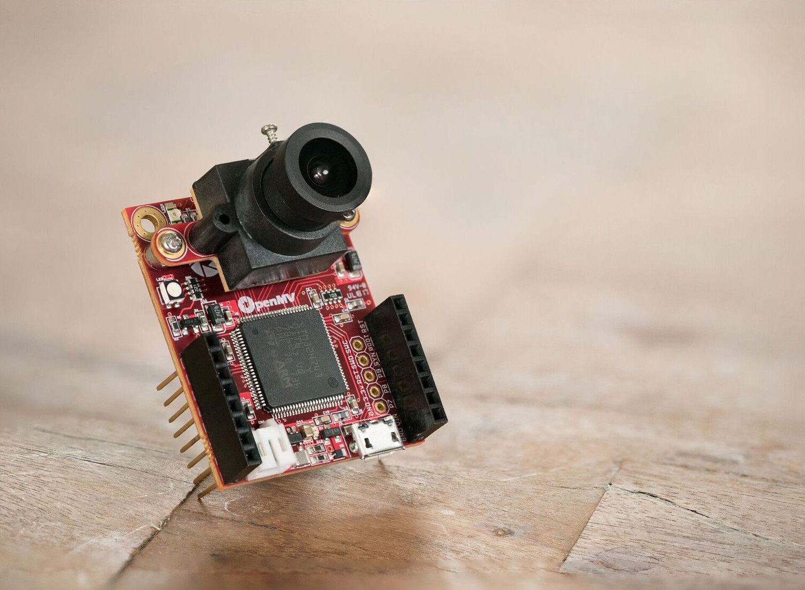

Overview
========

Hi, thanks for reading this tutorial and being interested in the OpenMV Cam! Before
getting into the tuturial I'd like to quickly go over why the OpenMV Cam exists
and what it's designed to be used for.

Currently, doing anything serious involving computer vision requires a computer
running an operating system running may layers of software and requiring much
setup before you can get computer vision code working. This is all well and fine
if you need to do many other things than just processing images, like connecting
to the internet, running many different applications concurrently, etc.

But, what if, I just want to make an LED turn on if a red object appears in front
of a white wall. Why do a need to build up a complex system for that? Or, what
if I just want to turn on an LED when a face is in view?

For example, if I wanted to turn an LED on for a short duration when a line sensor was
broken I'd use an Arduino to accomplish this. I'd write about 10 lines of
code and be done with it. And... after flashing the Arduino that code would run
happily forever.

But, if I want to use a 2D sensor like a camera everything changes.
Since a camera sensor generates tons of data a faster more resourceful computer is
required to process the sensor data. Now, with this faster more powerful computer
you can definately do many more things. But, what if my goal were still to just
turn on an LED? Spin a motor? Or open a valve? Could I still get the Arduino
like experience with a camera sensor?

Yes! This is the point behind the OpenMV Cam. A little programmable computer to
do simple computer vision things!

Our goal with the OpenMV Cam is to make a flexible system for solving very
straight forward computer vision problems. To achieve this goal we built the
OpenMV Cam on-top of MicroPython running on a microcontroller. This approach
allows you to write Python scripts to execute on the OpenMV which compile and
load extremely fast while maintaining microcontroller benefits like low power
consumption and instant on processing for embedded applications.

Now, the OpenMV Cam isn't the answer to all computer vision problems, or even most.
You should use a single-board-computer running linux and OpenCV when required. But,
if you just need to do some simple thing with a camera the OpenMV Cam might
be the right tool for the job.

For more information about this see our `FAQ <https://openmv.io/pages/faq>`_.
